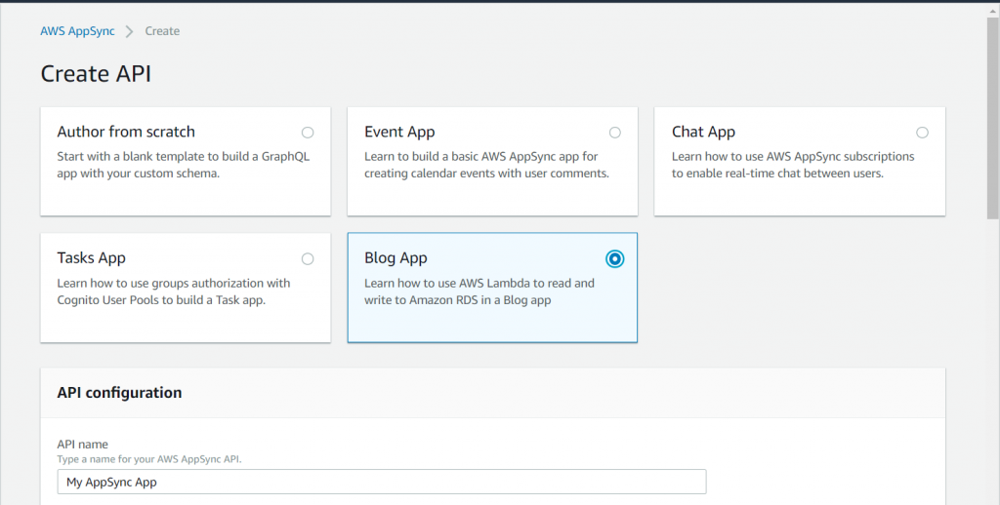
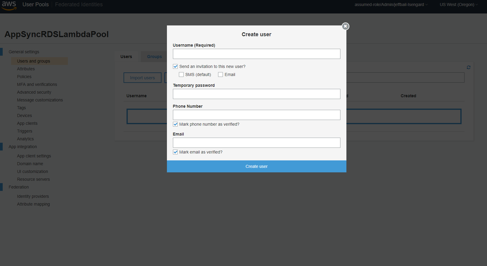
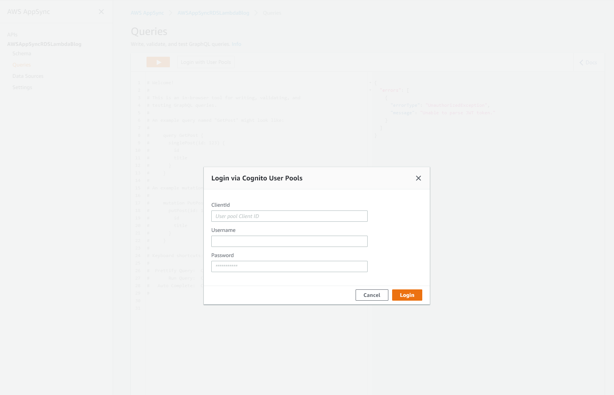
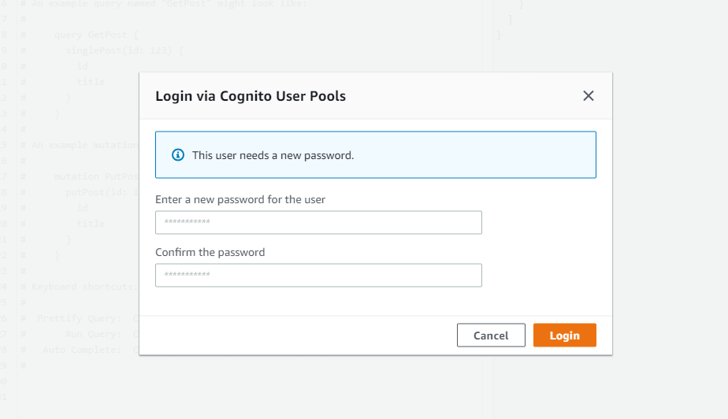

# AWS AppSync Using Amazon Aurora as a Data Source via AWS Lambda

## Introduction

This sample application will create all of the AWS resources you need to have an AppSync GraphQL API that fronts an RDS Aurora cluster, doing so via a Lambda function. All resources are created with AWS CloudFormation. 

Specifically, it will provision the AppSync API (including the schema, data source, and all resolvers), the Cognito user pool used for authorization, an RDS cluster that runs on Amazon Aurora MySQL, and a Lambda function to serve as the go-between. Both the Lambda function and the RDS resources will reside in a newly created VPC. 

This sample will work out of the box in every region that AppSync is available, and will show how you can use GraphQL to interact with your database, as well as how the requests translate into SQL. You can use this sample application for learning purposes or adapt the resources to meet your own needs.

## Features
The schema is a light blog design - the out of the box types are 'Posts' and 'Comments'.

* GraphQL Mutations
  * Create new posts
  * Create comments on existing posts
  * Increment view counts on existing posts
  * Upvote comments on existing posts
  * Downvote comments on existing posts

* GraphQL Queries
  * Get a post
  * Get all posts by an author
  * Get all of the comments on a post
  * Get the number of comments on a post
  * Get all comments by an author
  
* GraphQL Subscriptions
  * Real time updates for comments added to a post
  * Real time updates for comments added by an author
  * Real time udpates for posts added by an author
  
* Authorization
  * This sample app uses Cognito User Pools as the authorization mechanism
  
* Dependency Versions
  * The Lambda code runs Node.js 8.10
  * The RDS cluster runs Aurora MySQL 5.7
  * The RDS instance is a t2.medium

## Setting up the Sample

### Create CloudFormation Stack

The sample spins up several AWS resources via CloudFormation, so step one to using it is creating the CloudFormation stack. Note the AppSync GraphQL API name when you're creating it - it's an input in creating the stack, and will be necessary later. Creating the stack can be done any of the following ways:

#### From Here

| AWS Region | Short name | | 
| -- | -- | -- |
| US East (Ohio) | us-east-2 | [](https://console.aws.amazon.com/cloudformation/home?region=us-east-2#/stacks/new?stackName=AWSAppSyncRDSLambdaSample&templateURL=https://s3-us-west-2.amazonaws.com/awsappsync/cf-templates/rdslambda/deploy-cfn.yml) |
| US East (N. Virginia) | us-east-1 | [](https://console.aws.amazon.com/cloudformation/home?region=us-east-1#/stacks/new?stackName=AWSAppSyncRDSLambdaSample&templateURL=https://s3-us-west-2.amazonaws.com/awsappsync/cf-templates/rdslambda/deploy-cfn.yml) |
| US West (Oregon) | us-west-2 | [](https://console.aws.amazon.com/cloudformation/home?region=us-west-2#/stacks/new?stackName=AWSAppSyncRDSLambdaSample&templateURL=https://s3-us-west-2.amazonaws.com/awsappsync/cf-templates/rdslambda/deploy-cfn.yml) |
| EU (Ireland) | eu-west-1 | [](https://console.aws.amazon.com/cloudformation/home?region=eu-west-1#/stacks/new?stackName=AWSAppSyncRDSLambdaSample&templateURL=https://s3-us-west-2.amazonaws.com/awsappsync/cf-templates/rdslambda/deploy-cfn.yml) |
| EU (Frankfurt) | eu-central-1 | [](https://console.aws.amazon.com/cloudformation/home?region=eu-central-1#/stacks/new?stackName=AWSAppSyncRDSLambdaSample&templateURL=https://s3-us-west-2.amazonaws.com/awsappsync/cf-templates/rdslambda/deploy-cfn.yml) |
| Asia Pacific (Tokyo) | ap-northeast-1 | [](https://console.aws.amazon.com/cloudformation/home?region=ap-northeast-1#/stacks/new?stackName=AWSAppSyncRDSLambdaSample&templateURL=https://s3-us-west-2.amazonaws.com/awsappsync/cf-templates/rdslambda/deploy-cfn.yml) |
| Asia Pacific (Sydney) | ap-southeast-2 | [](https://console.aws.amazon.com/cloudformation/home?region=ap-southeast-2#/stacks/new?stackName=AWSAppSyncRDSLambdaSample&templateURL=https://s3-us-west-2.amazonaws.com/awsappsync/cf-templates/rdslambda/deploy-cfn.yml) |
| Asia Pacific (Singapore) | ap-southeast-1 | [](https://console.aws.amazon.com/cloudformation/home?region=ap-southeast-1#/stacks/new?stackName=AWSAppSyncRDSLambdaSample&templateURL=https://s3-us-west-2.amazonaws.com/awsappsync/cf-templates/rdslambda/deploy-cfn.yml) |
| Asia Pacific (Mumbai) | ap-south-1 |  [](https://console.aws.amazon.com/cloudformation/home?region=ap-south-1#/stacks/new?stackName=AWSAppSyncRDSLambdaSample&templateURL=https://s3-us-west-2.amazonaws.com/awsappsync/cf-templates/rdslambda/deploy-cfn.yml) |

#### From the AppSync Console

The AppSync console has the new sample added as well, entitled 'Blog App'. It will spin up the exact same template linked above and in this repository.



#### Customize Your Own

If you want to customize your own version of the template, that can easily be done by using this repository. Just download [the template](https://github.com/aws-samples/AWS-AppSync-rds-aurora-sample/blob/master/src/appsyncrdslambdasampletemplate.yaml), customize it to fit your own needs, then upload it to the CloudFormation console.

##### Customizing the Lambda

By default, the CloudFormation template will pull the Lambda code from an S3 bucket owned by AppSync. It's possible to simply update the Lambda code once it's deployed, which might be quicker for testing purposes, but you might want to customize the code that gets used if your needs are more complex or require multiple stack builds, in which case you can easily customize the included Lambda code as needed. The entirety of what is pulled from the AppSync S3 bucket is in the src/lambdaresolver directory of this repository. Pull the contents of that directory, and customize the index.js file as needed. 

Lambda requires a specific format for code it executes - it must be inside a zip file with only the contents of the lambdaresolver directory, *not a zip of the lambdaresolver directory*. You'll need to upload that zip file to an S3 bucket in your own account, and then update the CloudFormation template to point to that S3 bucket and key. Also note that you'll need to update the 'Handler' field in the same resource if you re-name index.js. Both of these fields are in the 'AppSyncRDSLambda' resource in the template. 

This sample uses some SQL to set up the database and necessary tables during the Lambda function's execution. You'll likely want to remove that code when customizing it. 

If you do change the SQL and/or GraphQL schema, you'll likely want to look at the [resolver mapping templates](https://docs.aws.amazon.com/appsync/latest/devguide/resolver-mapping-template-reference-overview.html) in the AppSync console. These handle the logic that translates the GraphQL requests into SQL. The below example is used to get a post:

```
{
    "version" : "2017-02-28",
    "operation": "Invoke",
    "payload": {
        "sql":"SELECT * FROM posts WHERE id = :POST_ID",
        "variableMapping": {
            ":POST_ID" : "$context.arguments.id"
        }
    }
}
```

### Setting Up Authorization

The sample uses [Cognito User Pools](https://docs.aws.amazon.com/appsync/latest/devguide/security.html#amazon-cognito-user-pools-authorization) for authorization. Now that the sample stack has been created, the next step is creating a Cognito user to sign in. You can do this programatically, but the easiest way to do this is via the Cognito console. Go there, then click 'Manage User Pools'. Next, you will see a list of different user pools under your account. By default, the sample will create one with the name 'AppSyncRDSLambdaPool' - click into that. You'll need two things from this console:

#### Client Id
The CloudFormation stack will automatically create the client resource for you. You can get it by clicking 'App clients', in which it will be under the text 'App client id'.

#### A Created User
You'll need a user to exist under this pool to sign in with on the AppSync console. To create one, click on 'Users and groups' inside the created user pool page.



Input a username for the user and a temporary password. Insert your phone number (with the country code, of the format +15555555555) in the 'Phone Number' field, check 'SMS (default)', and uncheck 'Mark email as verified'. This will text your phone with the username and temporary password for the user. If you don't enter a temporary password, a random one will be auto-generated for you. This will create the user with status 'FORCE_CHANGE_PASSWORD', which is Cognito's way of making sure an ['admin-created user'](https://docs.aws.amazon.com/cognito/latest/developerguide/how-to-create-user-accounts.html) changes their password before they're able to sign in successfully. The AppSync console will take care of this for you.

#### Authorizing on the AppSync Console

There's one last step before you're ready to play with the sample. Go to the AppSync console, and click on the API that was created with the stack. Click on 'Queries' on the side of the page. At the top, you'll see a button to log in with User Pools. Click that.



Once you sign in with the client id, username, and temporary password you used, the console will prompt you to give a new password. This is normal for 'admin-created users'. We have to change it once to get the user out of state 'FORCE_CHANGE_PASSWORD'. Use whatever password you like - this will be permanent.



## Using the Sample

Now you're free to use the sample! Here's some queries and mutations to get you started:

Hypothetical author Shaggy creates a new post:
```
mutation CreatePost{
  createPost(author:"Shaggy", content:"Hello there"){
    id
    author
    content
    views
  }
}
```
Let's say the id that was returned was "123"

Hypothetical reader Nadia pulls up that post, running both of the below commands: 
```
mutation IncrementViewCount{
  incrementViewCount(id:"123"){
    id
    views
  }
}

query GetPost{
  getPost(id:"123"){
    id
    author
    content
    views
    comments {
      id
      author
      content
    }  
  }
}
```

Now, let's say Nadia liked the post enough to leave a comment on it:
```
mutation CreateComment{
  createComment(postId:"123", author:"Nadia", content:"Great stuff"){
    id
    author
    postId
  }
}
```

Let's pretend Shaggy saw this comment (that was given id 456) and wanted to upvote it:
```
mutation UpvoteComment{
  upvoteComment(id:"456"){
    id
    upvotes
    downvotes
  }
}
```

Now let's say Shaggy wanted to see all of Nadia's comments:
```
query GetCommentsByAuthor{
  getCommentsByAuthor(author:"Nadia"){
    id
    author
    content
    upvotes
    downvotes
  }
}
```

Say Shaggy liked what Nadia had to say, and decided to get all of her future comments:
```
subscription AddedCommentByAuthor{
  addedCommentByAuthor(author:"Nadia"){
    id
    author
    content
  }
}
```
Note: subscriptions are long-running processes that won't show anything until a mutation runs. To do this, you'll need two tabs in the AppSync console - one to execute the subscription and then a second to execute the mutation. Additionally, AppSync requires that filters in subscriptions be in the response of the mutation, so createComment must return author to do this.


## License Summary

This sample code is made available under a modified MIT license. See the LICENSE file.

